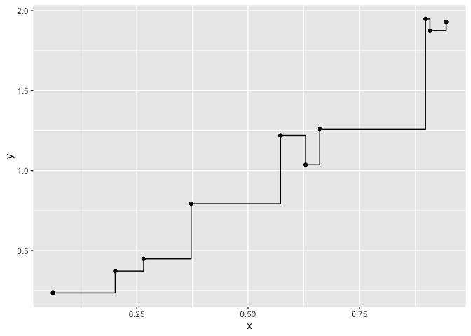

<!-- README.md is generated from README.Rmd. Please edit that file -->

# treesnip

<!-- badges: start -->

[](https://github.com/curso-r/treesnip)
<!-- badges: end -->

## Installation

You can install the released version of treesnip from
[CRAN](https://CRAN.R-project.org) with:

``` r
remotes::install_github("curso-r/treesnip")
```

## Example

This package provides the `tree` engine for `decision_tree` in parsnip.

``` r
library(treesnip)
library(tidymodels)
#> ── Attaching packages ───────────────────────────────── tidymodels 0.1.0.9000 ──
#> ✓ broom     0.5.5          ✓ recipes   0.1.9     
#> ✓ dials     0.0.4          ✓ rsample   0.0.5     
#> ✓ dplyr     0.8.5          ✓ tibble    2.1.3     
#> ✓ ggplot2   3.3.0          ✓ tune      0.0.1.9000
#> ✓ infer     0.5.1          ✓ workflows 0.1.0.9000
#> ✓ parsnip   0.0.5.9000     ✓ yardstick 0.0.5     
#> ✓ purrr     0.3.3
#> ── Conflicts ───────────────────────────────────────── tidymodels_conflicts() ──
#> x purrr::discard()  masks scales::discard()
#> x dplyr::filter()   masks stats::filter()
#> x dplyr::lag()      masks stats::lag()
#> x ggplot2::margin() masks dials::margin()
#> x recipes::step()   masks stats::step()

set.seed(1)
df <- tibble(
  x = runif(10), 
  y = 2* x + rnorm(10, sd = 0.1)
)

mod <- decision_tree(min_n = 0, cost_complexity = 0) %>%
  set_engine("tree") %>%
  set_mode("regression") %>% 
  fit(y ~ x, df)

mod
#> parsnip model object
#> 
#> Fit time:  7ms 
#> node), split, n, deviance, yval
#>       * denotes terminal node
#> 
#>  1) root 10 3.840000 1.1120  
#>    2) x < 0.472489 4 0.168700 0.4627  
#>      4) x < 0.318816 3 0.023280 0.3526  
#>        8) x < 0.131734 1 0.000000 0.2361 *
#>        9) x > 0.131734 2 0.002899 0.4109  
#>         18) x < 0.233595 1 0.000000 0.3728 *
#>         19) x > 0.233595 1 0.000000 0.4490 *
#>      5) x > 0.318816 1 0.000000 0.7930 *
#>    3) x > 0.472489 6 0.863300 1.5440  
#>      6) x < 0.779594 3 0.028200 1.1720  
#>       12) x < 0.644956 2 0.016700 1.1280  
#>         24) x < 0.600984 1 0.000000 1.2200 *
#>         25) x > 0.600984 1 0.000000 1.0370 *
#>       13) x > 0.644956 1 0.000000 1.2590 *
#>      7) x > 0.779594 3 0.002936 1.9170  
#>       14) x < 0.903299 1 0.000000 1.9480 *
#>       15) x > 0.903299 2 0.001476 1.9010  
#>         30) x < 0.926442 1 0.000000 1.8740 *
#>         31) x > 0.926442 1 0.000000 1.9280 *

df %>% 
  mutate(pred = predict(mod, df)$.pred) %>% 
  ggplot(aes(x = x)) +
  geom_point(aes( y = y)) +
  geom_step(aes(y = pred))
```


